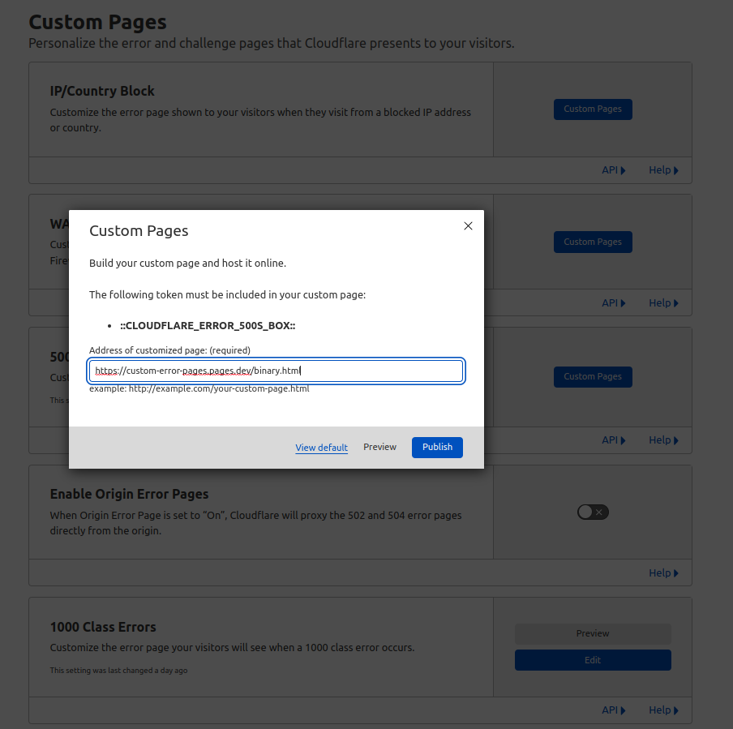

# Custom Error Pages for 5xx and 1xxx
These are the custom error pages to replace default Cloudflare error pages.

## Design details
- The pages are generic enough for all kind of error (can be firewall block, overloaded origin, etc...)
- Debug info are not shown but available in source for us to investigate
- Same page is used for both 5xx and 1xxx (both token in the page)
- Design follows color schemes from binary.com and deriv.com respectively
- There is a limit in size of what you can use as custom error page
- All external css or images will be inlined during publish

## How to install
1. Publish the page somewhere online (you can use `custom-error-pages` Cloudflare Pages see [binary](https://custom-error-pages.pages.dev/binary) and [deriv](https://custom-error-pages.pages.dev/deriv))
2. Install the custom pages in Cloudflare

## Resources
- [Cloudflare documentation - Custom Error Pages](https://support.cloudflare.com/hc/en-us/articles/200172706-Configuring-Custom-Pages-Error-and-Challenge-)

